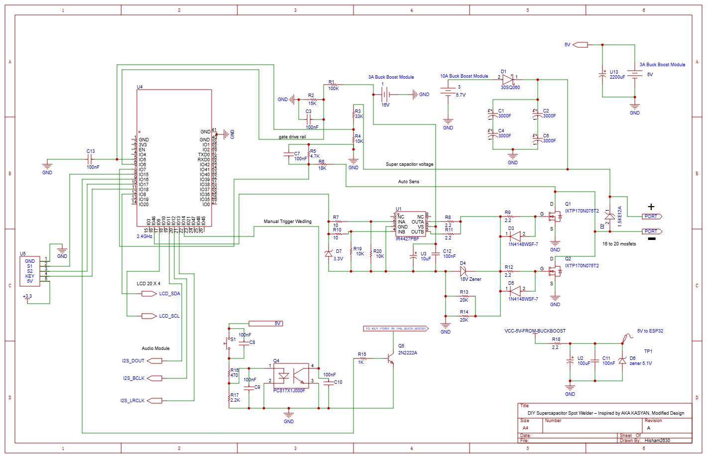
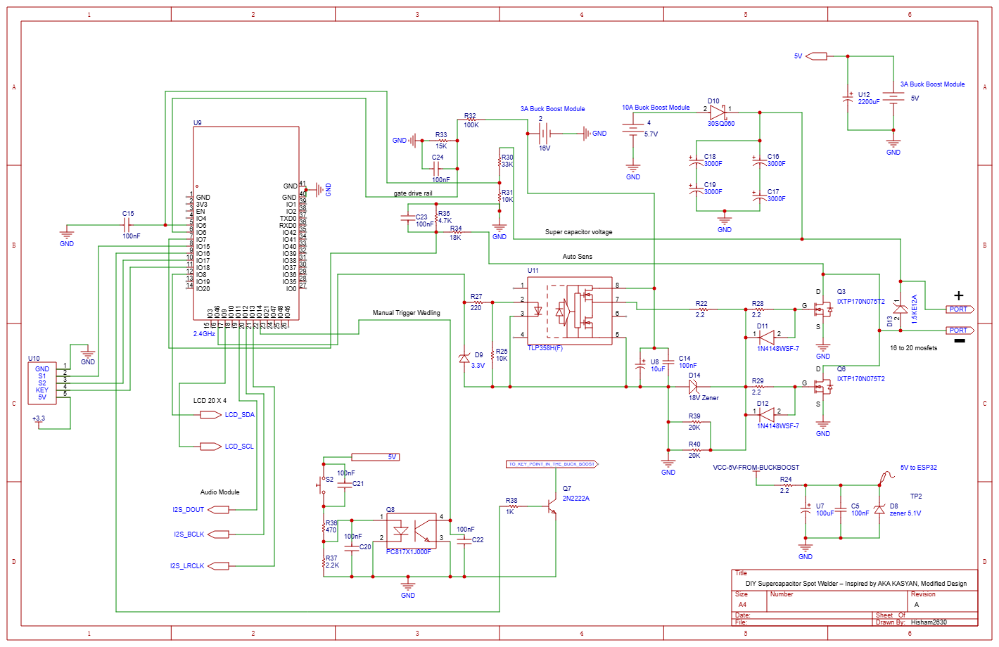

# ⚡ MyWeld ESP32 Firmware

> Supercapacitor spot welder controller firmware for the **Guition JC3248W535** development board (ESP32-S3, 480×320 TFT, AXS15231B touch).

[](https://www.espressif.com/en/products/socs/esp32-s3)
[](https://docs.espressif.com/projects/esp-idf/)
[](https://platformio.org/)
[](https://lvgl.io/)
[](#)

---

## 📋 Table of Contents

- [Overview](#overview)
- [Hardware](#hardware)
- [Schematic](#-schematic)
- [Architecture](#architecture)
- [Features](#features)
- [Weld Pulse Sequence](#weld-pulse-sequence)
- [BLE Protocol](#ble-protocol)
- [Pin Assignments](#pin-assignments)
- [Getting Started](#getting-started)
- [Project Structure](#project-structure)
- [Configuration](#configuration)
- [Safety Design](#safety-design)
- [Acknowledgments](#acknowledgments)

---

## Overview

**MyWeld** is a DIY supercapacitor spot welder controlled by an ESP32-S3 microcontroller, adapted from the [**MyWeld V2.0 PRO**](https://www.youtube.com/@akakasyan) by **Aka Kasyan**. The firmware provides:

- A full-color touchscreen UI (LVGL 9.x, 480×320) for real-time control and monitoring
- A dual-mode welding engine — **Manual** (button press) and **Auto** (contact detection)
- A **P1 / T / P2 dual-pulse** sequence for professional weld quality
- **BLE companion app** connectivity (Android) via a custom binary protocol
- Up to **10 named presets** stored in NVS (flash)
- **P1/T/P2/P3/P4 quad-pulse** support for advanced weld profiles
- **I2S audio** feedback (startup melody, beeps, error tones) with adjustable volume
- Real-time **supercapacitor voltage monitoring** with configurable max voltage (4.0–12.0 V)
- **ADC calibration** system with per-channel correction factors stored in calibration partition

---

## Hardware

| Component | Part |
|---|---|
| **MCU Board** | Guition JC3248W535 (ESP32-S3, 16 MB Flash, PSRAM) |
| **Display** | 3.5″ 480×320 TFT, QSPI, AXS15231B controller |
| **Touch** | Capacitive touch via I2C (addr `0x3B`) |
| **Audio** | Built-in I2S amplifier → speaker (P6 header) |
| **Supercap Bank** | Configurable — supports 4.0–12.0 V (e.g., 2S2P @ 5.7 V or 4S @ 12.0 V) |
| **Gate Driver** | IR4427PBF (half-bridge) or TLP358H(F) (photocoupler) |
| **Output** | MOSFET bank fire signal (`GPIO 46`) |
| **Charger** | Supercap charger enable (`GPIO 16`, active-LOW) |
| **Weld Button** | External trigger (`GPIO 14`, active-LOW, pull-up) |

---

## 🔌 Schematic

Two gate-driver variants are provided — choose the one matching your build:

### Variant A — IR4427 Half-Bridge Gate Driver

<p align="center">
  
</p>

### Variant B — TLP358H(F) Photocoupler Gate Driver

<p align="center">
  
</p>

> EasyEDA project files are in the [`Schematic/`](Schematic/) folder.

---

## Architecture

The firmware runs **5 FreeRTOS tasks** pinned to two cores:

```
Core 0                          Core 1
──────────────────────          ────────────────────────────
ui_task      (priority 5)       welding_task  (priority 10)  ← highest
ble_task     (priority 1)       adc_task      (priority  3)
                                audio_task    (priority  2)
```

**Core 0** handles all UI rendering (LVGL) and BLE communication.  
**Core 1** handles time-critical welding pulses, ADC voltage sampling, and audio output.

### Initialization Order (Safety-Critical)

```
1. GPIO safe defaults  ← MOSFET = LOW immediately on boot
2. NVS init           ← Load saved settings / presets
3. I2S audio init
4. Display + LVGL init
5. UI build
6. Welding state machine init
7. BLE serial init
8. Launch FreeRTOS tasks
```

---

## Features

### ✅ Dual Welding Modes

| Mode | Trigger | Description |
|------|---------|-------------|
| **MAN** (Manual) | Physical button (`GPIO 14`) | Press and hold to fire |
| **AUTO** | Electrode contact detection (`GPIO 7`) | Auto-fires after configurable delay `S` |

### ✅ P1/T/P2/P3/P4 Multi-Pulse Sequence

```
[P1] ─ [T] ─ [P2] ─ [T] ─ [P3] ─ [T] ─ [P4]
  │                                        │
0.0–50 ms each         (P2/P3/P4 = 0 → disabled)
```

P3 and P4 are optional additional pulses for advanced weld profiles.

### ✅ Real-Time Status Display

- Supercapacitor voltage bar (0–max V with color coding, configurable max)
- Charge percentage (derived from configurable max voltage)
- Weld state indicator (IDLE / ARMED / FIRING / BLOCKED / ERROR)
- Session and lifetime weld counters
- Active preset name
- Volume level indicator

### ✅ Preset Management

- 20 preset slots — 7 factory (read-only) + 13 user-custom (up to 20 chars each)
- Stores: P1, T, P2, S, mode (AUTO/MAN)
- Instantly loadable from UI or Android app

### ✅ BLE Remote Control

- Device advertises as `"MyWeld"` (configurable display name)
- PIN authentication (default: `1234`)
- Real-time status notifications every ~500 ms
- Read/write all weld parameters remotely
- Load/save presets remotely

### ✅ Audio Feedback

| Tone | Event |
|------|-------|
| Startup melody (C–E–G) | Boot complete |
| Double beep (D5–A5) | BLE connected |
| Single beep (880 Hz) | Parameter changed |
| High beep (1200 Hz) | Pulse fired |
| Error melody | Fault / blocked |
| Contact tone (1000 Hz) | AUTO contact detected |

### ✅ Configurable Supercap Voltage

- Max voltage configurable from **4.0 V to 12.0 V** (step: 0.01 V)
- Stored in calibration partition — survives factory reset
- All thresholds derived automatically:
  - Full = max − 0.2 V
  - Low warning = 70% of max
  - Low block = 50% of max
  - Contact detect = dynamic (based on voltage divider ratio)
- Settable from Android app via BLE calibration command (channel 2)

### ✅ Safety Features

- MOSFET output driven **LOW on boot** before any other init
- Low-voltage block: refuses to weld below **50% of max voltage**
- Low-voltage warning: at **70% of max voltage**
- Charger disabled during pulse (prevents charging during discharge)
- ADC-based protection rail monitoring (gate-drive health check)
- NVS write debouncing (prevents flash wear)
- BLE authentication with **brute-force lockout** (escalating delays)

---

## Weld Pulse Sequence

```
        ┌─ charger OFF ────────────────────────────────────────────────┐
        │  settle 500µs                                                settle 500µs
        │          ┌────┐      ┌────┐      ┌────┐      ┌────┐         │
OUTPUT  │          │ P1 │  T  │ P2 │  T  │ P3 │  T  │ P4 │         │
────────┘          └────┘      └────┘      └────┘      └────┘         └── charger ON
        │←500µs→│← P1→│←T→│← P2→│←T→│← P3→│←T→│← P4→│←500µs→│
```

- **P1**: Pre-pulse (cleans surface, typically 3–8 ms)  
- **T**: Pause between pulses (typically 5–10 ms)  
- **P2**: Main pulse (fuses metal, typically 5–15 ms). Set to 0 for single-pulse mode.
- **P3**: Optional third pulse (set to 0 to disable)
- **P4**: Optional fourth pulse (set to 0 to disable)

---

## BLE Protocol

The firmware uses a custom **binary protocol V2** over BLE GATT.

### GATT Service

| Attribute | UUID |
|-----------|------|
| Service | `00001234-0000-1000-8000-00805F9B34FB` |
| Params Char (READ) | `00001235-0000-1000-8000-00805F9B34FB` |
| Status Char (NOTIFY) | `00001236-0000-1000-8000-00805F9B34FB` |
| Command Char (WRITE) | `00001237-0000-1000-8000-00805F9B34FB` |

### Packet Format

```
[SYNC=0xAA] [TYPE] [LEN] [PAYLOAD...] [CRC]
                                        └── XOR of TYPE + LEN + all PAYLOAD bytes
```

All multi-byte values are **little-endian**.

### Message Types

| Type | Direction | Description |
|------|-----------|-------------|
| `0x01` STATUS | ESP→App | 46-byte periodic status (via NOTIFY, ~500 ms) |
| `0x02` PARAMS_READ | App→ESP | Request current parameters |
| `0x03` PARAMS_RESPONSE | ESP→App | Current parameters (28 bytes) |
| `0x04` PARAMS_WRITE | App→ESP | Update parameters |
| `0x05` CMD | App→ESP | Execute command (sub-typed) |
| `0x06` ACK | ESP→App | Success response |
| `0x07` NAK | ESP→App | Error response |
| `0x08` VERSION | App→ESP | Request firmware version |
| `0x09` VERSION_RESPONSE | ESP→App | Firmware version info |
| `0x0D` AUTH_REQUEST | App→ESP | Authenticate with PIN |
| `0x0E` AUTH_RESPONSE | ESP→App | Authentication result |

### Status Packet (0x01) — 46 bytes

| Offset | Field | Type | Notes |
|--------|-------|------|-------|
| 0 | `supercap_mv` | u16 | Supercap voltage in mV |
| 2 | `protection_mv` | u16 | Gate drive rail in mV |
| 4 | `state` | u8 | Weld state enum |
| 5 | `charge_percent` | u8 | 0–100 % |
| 6 | `auto_mode` | u8 | 0=MAN, 1=AUTO |
| 7 | `active_preset` | u8 | 0–19 (0xFF = user-defined) |
| 8 | `session_welds` | u32 | Session counter |
| 12 | `total_welds` | u32 | Lifetime counter |
| 16 | `ble_connected` | u8 | 1 if BLE connected |
| 17 | `sound_on` | u8 | |
| 18 | `theme` | u8 | 0=dark, 1=light |
| 19 | `error_code` | u8 | 0=none |
| 20 | `p1_x10` | u16 | P1 × 10 (e.g. 50 = 5.0 ms) |
| 22 | `t_x10` | u16 | T × 10 |
| 24 | `p2_x10` | u16 | P2 × 10 |
| 26 | `p3_x10` | u16 | P3 × 10 (0 = disabled) |
| 28 | `p4_x10` | u16 | P4 × 10 (0 = disabled) |
| 30 | `s_x10` | u16 | S × 10 (e.g. 5 = 0.5 s) |
| 32 | `fw_major` | u8 | Firmware major version |
| 33 | `fw_minor` | u8 | Firmware minor version |
| 34 | `volume` | u8 | Master volume 0–100% |
| 35 | `auth_lockout_sec` | u8 | Remaining lockout seconds |
| 36 | `raw_supercap_mv` | u16 | Uncalibrated supercap voltage |
| 38 | `raw_protection_mv` | u16 | Uncalibrated protection voltage |
| 40 | `cal_factor_v_x1000` | u16 | Supercap cal factor × 1000 |
| 42 | `cal_factor_p_x1000` | u16 | Protection cal factor × 1000 |
| 44 | `max_supercap_mv` | u16 | Configured max supercap voltage (mV) |

### Commands (`0x05` CMD sub-types)

| Sub-type | Command |
|----------|---------|
| `0x01` | Load preset by index |
| `0x02` | Save current params as preset |
| `0x03` | Factory reset |
| `0x04` | Reset weld counter |
| `0x05` | Calibrate ADC (ch0=supercap, ch1=protection, ch2=max voltage) |
| `0x06` | Authenticate (PIN) |
| `0x07` | Change PIN |
| `0x08` | Reboot device |

---

## Pin Assignments

| Function | GPIO | Notes |
|----------|------|-------|
| MOSFET fire output | 46 | Active HIGH, pull-down |
| Charger enable | 16 | Active LOW |
| Weld button | 14 | Active LOW, pull-up |
| Supercap voltage ADC | 5 | ADC1_CH4, 33k+10k divider |
| Protection rail ADC | 6 | ADC1_CH5, 100k+15k divider |
| Contact detect ADC | 7 | ADC1_CH6, 18k+4.7k divider |
| LCD QSPI CLK | 47 | Internal, no user wiring |
| LCD QSPI CS | 45 | Internal |
| LCD TE | 38 | Internal |
| LCD Backlight | 1 | PWM |
| LCD D0–D3 | 21, 48, 40, 39 | Internal |
| Touch SCL | 8 | I2C |
| Touch SDA | 4 | I2C |
| I2S LRCLK (WS) | 2 | Audio |
| I2S BCLK | 42 | Audio |
| I2S DOUT | 41 | Audio |

---

## Getting Started

### Prerequisites

- [PlatformIO IDE](https://platformio.org/) (VS Code extension or CLI)
- ESP32-S3 board (Guition JC3248W535 or compatible)
- USB cable (USB-C)

### Build & Flash

```bash
# Clone the repo
git clone https://github.com/hisham2630/MyWeld-ESP32.git
cd MyWeld-ESP32

# Flash to board (release build)
pio run -e jc3248w535 --target upload

# Monitor serial output
pio device monitor -e jc3248w535
```

### Debug Build

```bash
# Build with full symbols + halt-on-panic
pio run -e debug --target upload && pio device monitor -e debug
```

The debug environment uses `-Og` optimisation and `esp32_exception_decoder` for readable backtraces.

---

## Project Structure

```
MyWeld-ESP32/
├── platformio.ini          # Build configuration (release + debug envs)
├── partitions.csv          # Custom 16MB partition table
├── sdkconfig.defaults      # ESP-IDF SDK defaults
├── sdkconfig.jc3248w535    # Board-specific sdkconfig
├── pin-definition.txt      # Quick GPIO reference
├── Schematic/              # EasyEDA project + schematic images
│   ├── SCH_..._IR4427_2026-03-28.png   # Gate driver variant A
│   ├── SCH_..._TLP358_2026-03-28.png   # Gate driver variant B
│   └── easyida/            # EasyEDA source files
└── src/
    ├── main.c              # Entry point, task launcher
    ├── config.h            # All pin defs, thresholds, timing constants
    ├── display.c / .h      # QSPI display init, LVGL driver, backlight
    ├── ui.c / .h           # LVGL UI — screens, widgets, update callbacks
    ├── welding.c / .h      # Welding state machine + ADC task
    ├── encoder.c / .h      # KY-040 rotary encoder input (quadrature + button)
    ├── ble_serial.c / .h   # NimBLE GATT server + protocol handler
    ├── ble_protocol.h      # Binary protocol definitions (shared with Android)
    ├── settings.c / .h     # NVS settings load/save, presets, PIN
    ├── audio.c / .h        # I2S tone generator + sound effects
    ├── ota.c / .h          # OTA firmware update support
    ├── esp_lcd_axs15231b.c # AXS15231B QSPI display driver
    ├── esp_lcd_touch.c     # Capacitive touch I2C driver
    └── lv_conf.h           # LVGL configuration
```

---

## Configuration

All hardware and behaviour constants are in [`src/config.h`](src/config.h):

| Constant | Default | Description |
|----------|---------|-------------|
| `SUPERCAP_V_DEFAULT` | 5.7 V | Default max charge voltage |
| `SUPERCAP_V_MIN` | 4.0 V | Configurable range minimum |
| `SUPERCAP_V_MAX` | 12.0 V | Configurable range maximum |
| `SUPERCAP_V_STEP` | 0.01 V | Adjustment precision |
| `SUPERCAP_V_MULT` | 4.3 | Voltage divider multiplier (33k+10k) |
| `PULSE_MAX_MS` | 50 ms | Maximum pulse duration |
| `S_VALUE_DEFAULT` | 0.5 s | Default AUTO delay |
| `MAX_PRESETS` | 20 | Number of preset slots (7 factory + 13 user) |
| `BLE_DEVICE_NAME` | `"MyWeld"` | Default BLE advertised name |
| `PIN_DEFAULT` | `"1234"` | Factory PIN |
| `NVS_SAVE_DEBOUNCE_MS` | 2000 ms | Flash write debounce |
| `ADC_SAMPLE_INTERVAL` | 500 ms | Voltage sampling interval |

### Derived Thresholds (from `max_supercap_voltage`)

All voltage thresholds are computed dynamically at runtime:

| Threshold | Formula | Example (5.7V) |
|-----------|---------|----------------|
| Full voltage | `max - 0.2` | 5.5 V |
| Low warning | `max × 0.70` | 3.99 V |
| Low block | `max × 0.50` | 2.85 V |
| Contact detect | `max × R_low/(R_high+R_low) × 0.50` | Dynamic |

---

## Safety Design

> ⚠️ Supercapacitor spot welders store very high energy. The firmware includes multiple safety layers, but improper hardware wiring can still be dangerous. Always verify your hardware before operating.

1. **Boot-time GPIO safety** — `PIN_OUTPUT` is driven LOW **before any `app_main` logic runs** to prevent accidental MOSFET activation during boot.
2. **Voltage blocking** — Welding is hard-blocked when supercap voltage drops below 50% of configured max voltage, preventing weak/incomplete welds.
3. **Protection rail monitoring** — The 13.5 V gate-drive rail is sampled continuously; a fault blocks welding.
4. **Charger interlock** — The charger is disabled during the pulse window to prevent current fighting.
5. **NVS debouncing** — Parameter saves are debounced (`NVS_SAVE_DEBOUNCE_MS`) to reduce flash wear.
6. **BLE authentication** — All parameter writes and commands require PIN authentication with brute-force lockout.
7. **Calibration partition** — Max voltage and ADC cal factors stored in separate NVS partition, surviving factory resets.

---

## Companion App

The Android companion app for remote control is available at:  
👉 **[github.com/hisham2630/MyWeld-Android](https://github.com/hisham2630/MyWeld-Android)**

---

## Acknowledgments

This project is an ESP32-S3 adaptation of the **MyWeld V2.0 PRO** spot welder, originally designed and built by **[Aka Kasyan](https://www.youtube.com/@akakasyan)**.

A huge thank you to Aka Kasyan for:
- 🔩 The original **MyWeld V2.0 PRO** hardware design and PCB layout
- 💻 The proven **welding logic** (dual-pulse P1/T/P2 sequence, protection systems)
- 📺 The excellent **YouTube tutorials** that made this project possible
- 🌍 Sharing his knowledge and inspiring the maker/DIY community

The original project was built around an **Arduino Nano** with a 20×4 LCD, rotary encoder, and 12× IRL40SC228 MOSFETs. This adaptation ports the welding logic to an **ESP32-S3** (Guition JC3248W535) with a full-color TFT touchscreen, BLE companion app, I2S audio, and 16× IXTP170N075T2 MOSFETs — while preserving the core pulse generation and safety principles from Aka Kasyan's original design.

---

## License

This project is open source. See [LICENSE](LICENSE) for details.
